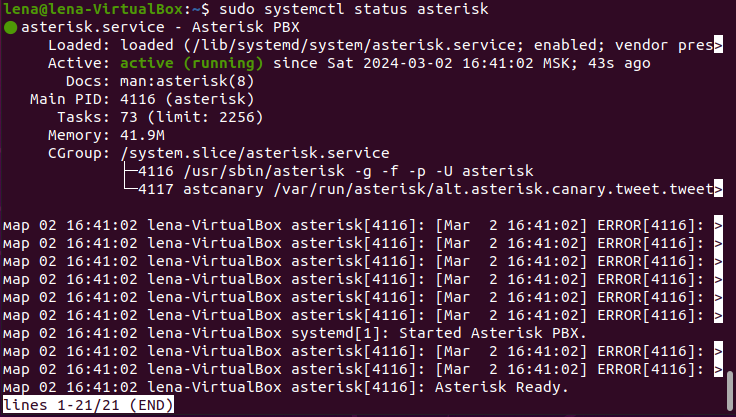
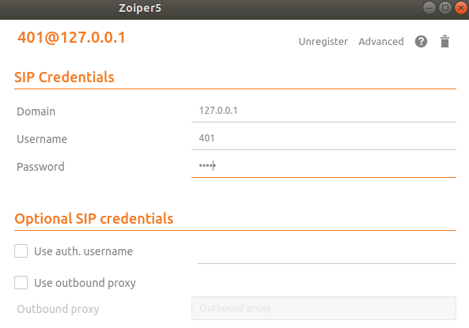
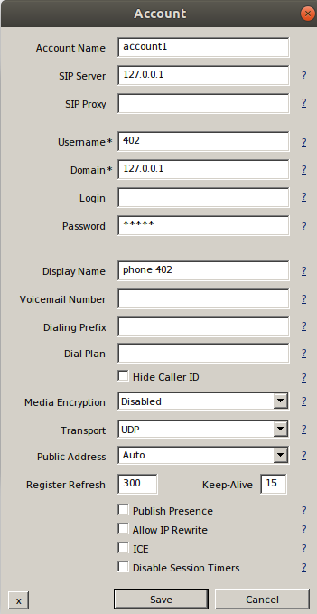
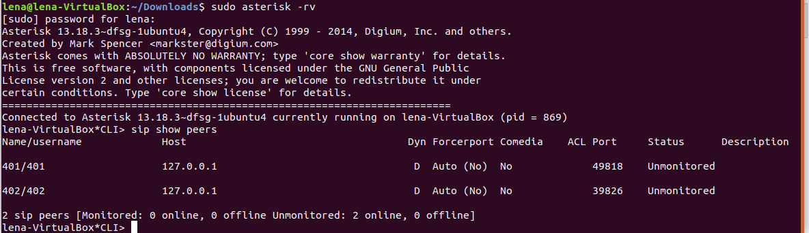
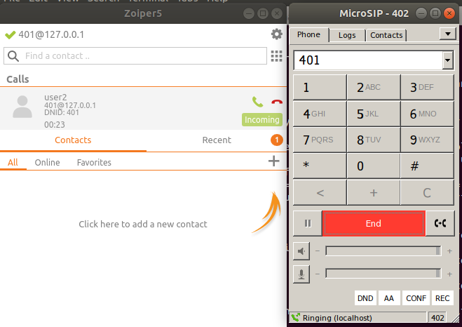

#### University: [ITMO University](https://itmo.ru/ru/)
#### Faculty: [FICT](https://fict.itmo.ru)
#### Course: [IP-telephony](https://github.com/itmo-ict-faculty/ip-telephony)
#### Year: 2023/2024
#### Group: K34212
#### Author: Spevak Elena
#### Lab: Lab2
#### Date of create: 10.03.2024
#### Date of finished: 12.03.2024

## Лабораторная работа №3

## "Использование Asterisk в качестве SIP proxy"

**Цель работы** - изучить программный комплекс Asterisk. Настройка Asterisk для локальных звонков.

**Ход работы:**

1. Установка и настройка Asterisk

Для установки Asterisk были использованы следующие команды:

```
sudo apt-get update
sudo apt-get install asterisk
```

После установки был проверен статус службы с помощью команды ```sudo systemctl status asterisk```



Для настроки службы в дириктории /etc/asterisk были отредактированы конфигурационные файлы sip.conf и extensions.conf. 

В первый файл были доабвлены 2 пользователя - внутренних абонента с номерами 401 и 402, заданы для них пароли(secret). пример внесенных имзенений представлен ниже:

```
[401]
type=friend
host=dynamic
secret=pass1
context=default

[402]
type=friend
host=dynamic
secret=pass2
context=default
```
В конфигурационном файле extensions.conf был настроен план набора(dialplan). Для этого было добавлено следующее:

```
[default]
exten => 401,1,Dial(SIP/401)
exten => 402,1,Dial(SIP/402)
```

После сохранения изменений служба astertisk был перезапущена (```sudo systemctl restart asterisk```).

2. Установка и настройка soft телефонов 

На рабочую станцию был установлен soft телефонов Zoiper и  MicroSIP.

**Zoiper5**

С официального сайта Zoiper5 был скачан установочный файл и произведена установка согласно [инструкции](https://www.zoiper.com/en/documentation/linux-installation-and-configuration).

После установки и запуска был настроен аккаунт: заполнены данными абонента 401. В качестве сервера был указан адрес локального хоста. Настройки аккаунта продемонстрированы ниже:



**MiscroSIP**

Для установки было необходимо было установить программу для использования  Windows-программ wine.

С официального сайта был скачен установочный файл MisroSIP-3.21.3.exe, после чего из дириктории Downloads была запущенна программа при помощи команды ```wine MicroSIP-3.21.3.exe```.

В акканут были внесены данные абонента 402, в качестве сервера был также указан адрес 127.0.0.1.



После настроек аккаунтов были проверены каналы SIP. Для этого была запущена косноль asterisk и введена следующая команда:

```
sudo asterisk -rv

sip show peers
```

Оба акканта добавлены, находятся в состоянии online и им назначены порты.



Для проверки связи был совершон звонок:



**Вывод**-был изучен программный комплекс Astrisk и была произведена его настройка для локальных звонков.